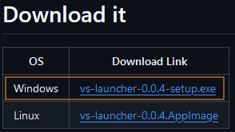

# Windows

The first thing you've to do is download the `.exe` from the Github Releases Page to install VS Launcher. Just follow this steps:



### Go to the [GitHub Releases Page](https://github.com/XurxoMF/vs-launcher/releases)

On that page you'll see all the available versions to download.



### Download the Windows version

On the releases page, the first version is always the last one. There you'll see a table with the different files to download. Just click on the Windows one like on the next image:




### Install the downloaded file

Double click the downloaded file and VS Launcher will be automátically installed and opened.



### Install .NET 7

If you already played Vintage Story before this will be already installed so, you can skip this process. If you didn't played it before go to e next link to download .NET 7:

[https://dotnet.microsoft.com/es-es/download/dotnet/thank-you/sdk-7.0.410-windows-x64-installer](https://dotnet.microsoft.com/es-es/download/dotnet/thank-you/sdk-7.0.410-windows-x64-installer)

Once the download is complete just install it.



And that's it... easy right? Now with this launcher it'll be even easier to install Vintage Story.
