# Option 2 (recomended)

This second option is harder to set up but once you've everything configured it'll be easier for you to translate as there is a GUI when you can sort the missing keys, write comments for other people...

If you choose this option just follow the next steps:

## How to translate



### **Donwload and install VSCode**

The first thing you need is to install Visual Studio Code. This is a text editor made by Microsoft and it's compatible with Windows, Linux and MacOS. It's used by most developers around the world and it counts with a lot of plugins to improve the experience, one of those is i18n Ally, the one we'll use.

You can download it from here: [VSCode official website](https://code.visualstudio.com/)

Just download it and install it like any other app.



### **Download and install GIT**

Git is the version control system used by most devs around the world. It's the "app" used to download and upload code changed to GitHub to explain it the easy way ^^

You can download it from here: [Git official website](https://git-scm.com/)

Just download it and install it like any other app.


During the installation you'll see a lot of options with checks and so on. Ignore them, just press next, next, next, next, install...




### **Install i18n Ally**

This is the Visual Studio Code Plugin I've mentioned before. To install it just go to the left panel, to the 4 cubes icon, and search `i18n Ally` on the search bar and install it like in the image:

<figure>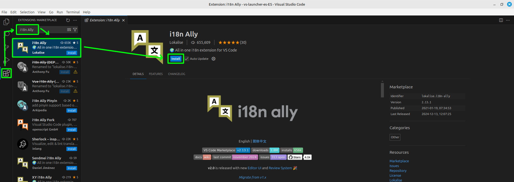<figcaption><p>Install i18n Ally on VSCode</p></figcaption></figure>



### **Create a GitHub account**

GitHub is used for storing code, collaboration on coding projects, and is also used as a version control system, among other things. It's used by most devs and companies around the world.

You can create an account here: [GitHub page](https://github.com/)

Just press the Sign In button and follow the steps.



### **Configure GitHub username and email locally**

You've installed Git on your PC but now you have to configure the account to use.

To do this just copy-paste the next commands one by one and execute them on your CMD, if you're using Windows, or Console, if you're using Linux, replacing `<username>` with your GitHub username and `<email>` with the email you've used to create your GitHub account (step 4).

```sh
git config --global user.email <email>
git config --global user.name <username>
```



### **Fork the VS Launcher repository**

You can't directly make changes on another user repository on GitHub, to do this you've to "copy" that repository to your account and edit it there. That's what a fork is, a copy of the original repository.

To do this just go to the [VS Launcher repository](https://github.com/XurxoMF/vs-launcher) and press the `fork` button ad the top, like in the image:

<figure>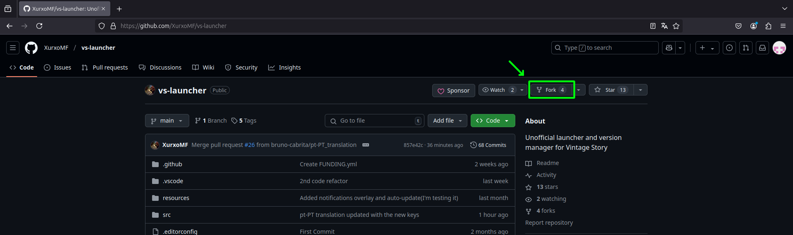<figcaption><p>Fork the VS Launcher GitHub repository</p></figcaption></figure>

Now change the name to `vs-launcher-xx-XX` depending on the language you'll translate to. For Spanish is `vs-launcher-es-ES` and for English is `vs-launcher-en-US` for example. You can also add a description but this is optional:

<figure>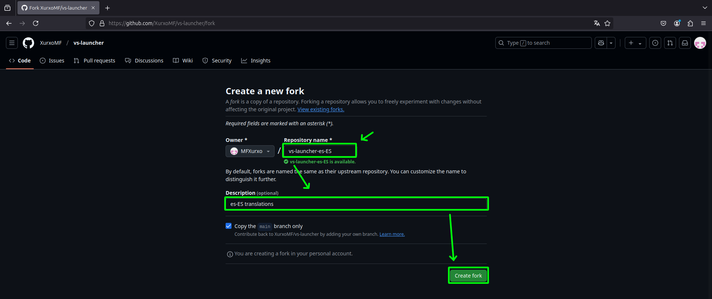<figcaption><p>Edit fork details</p></figcaption></figure>



### **Clone the repository and "link" it to the original repository**

Now you've a copy of the vs-launcher repository on your account but, you've to download it to your computer.

To do this just go the your repository on `profile` (top right corner) > `repositories` > `vs-launcher-xx-XX`, click on the green `Code` button and copy the link like in the image:

<figure>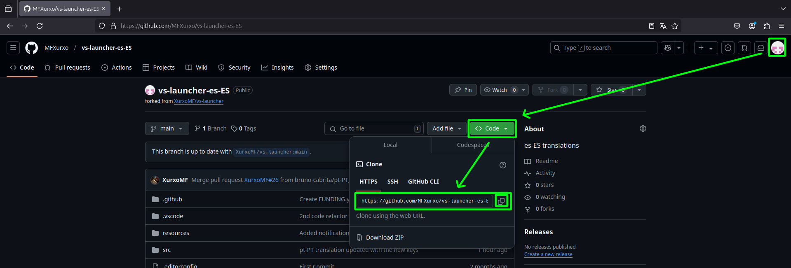<figcaption><p>Copy the repository URL</p></figcaption></figure>

Now open your CMD, if you're using Windows, or Console, if you're using Linux, and execute the next commands one by one replacing `<repository>` with the link you copied before and `xx-XX` with the ones used on your repository name:

```
git clone <repository>
cd vs-launcher-xx-XX
git remote add upstream https://github.com/XurxoMF/vs-launcher
```



### **Open the cloned folder on Visual Studio Code**

Open Visual Studio Code and open the folder you've cloned, it should be on your user folder like `C:/Users/YourUsername/vs-launcher-xx-XX` on Windows and `/home/YourUsername/vs-launcher-xx-XX` on Linux, if you cloned it elsewhere just select that folder:

<figure>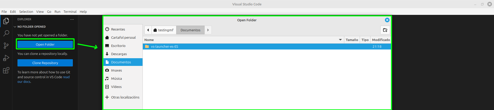<figcaption><p>Open the folder on VSCode</p></figcaption></figure>

Sometimes it'll ask you to trust the author of that folder, you in this case, just press yes like in the image:

<figure>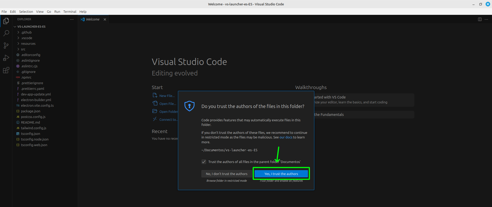<figcaption><p>Trust authors on VSCode</p></figcaption></figure>



### **Select the main language to use**

i18n Ally doesn't know by default which language to use as default, you've to specify it. For that just click the bottom right 🌐 button and select `en-US` like in the image:

<figure>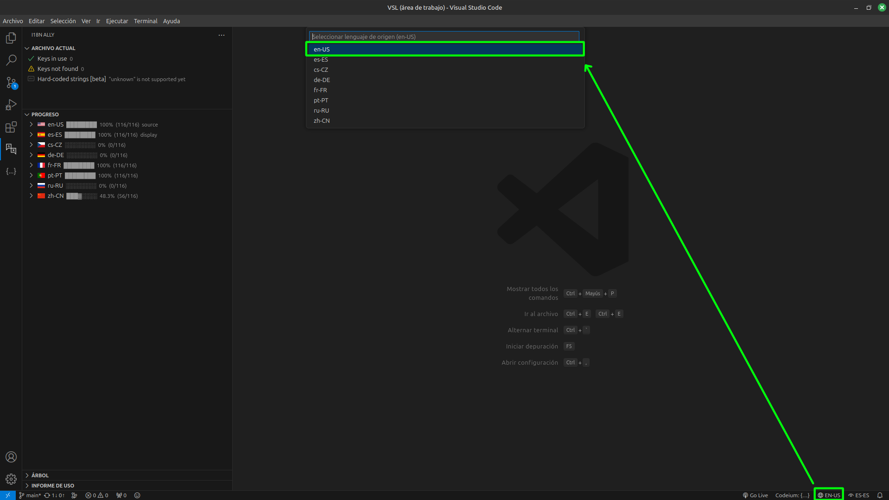<figcaption><p>Select i18n Ally language</p></figcaption></figure>



### **Open the editor and translate**

On the left menu you'll see a localization icon, if this one does not appear just click to open a few files from the left menu and wait a few seconds/a minute and it'll appear, it'll search for the lang files and do everything itself. Here you've a little video showing how to translate:

VÍDEO



### **Commit and push changes**

Now that you've translated everything you needed you just have to upload changes to you repository to later sync then with vs-launcher oficial repository.

To do this just go to the Git icon on the left menu, press stage files (➕ button), write a little text with the changes you've made (it can be "Translated" or "Updated translations") and commit:

<figure>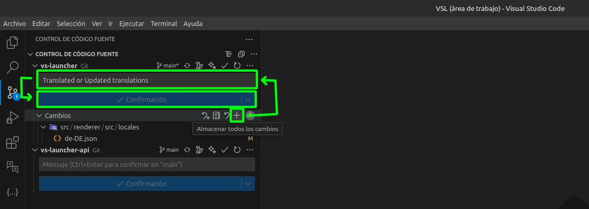<figcaption><p>Commit changes</p></figcaption></figure>

And now just push the changes to your repository (upload them)

<figure>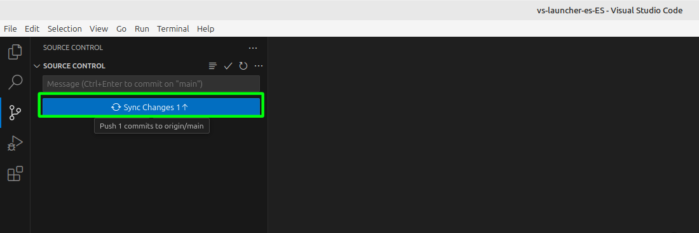<figcaption><p>Push changes</p></figcaption></figure>

the first time it'll ask you to login with your GitHub account. Just press yes on the popup, login on your browser, and press allow this link to be opened on VSCode:

<figure>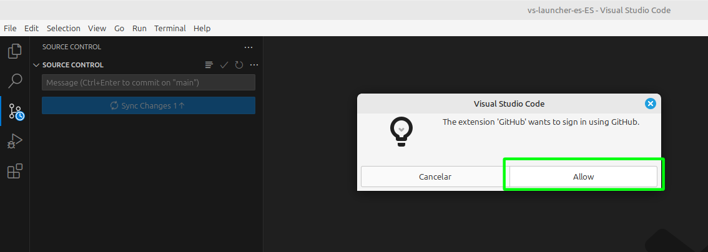<figcaption><p>Login with GitHub</p></figcaption></figure>



### **Send changes to the VS Launcher official repository | Pull Request**

Now you've translated and uploaded the translations to your repository but you've to send them to the official repository.

To do this just go to your GitHub account, open your repository and you'll see a `Contribute` button! Just click it and then click `Open pull request`:

<figure>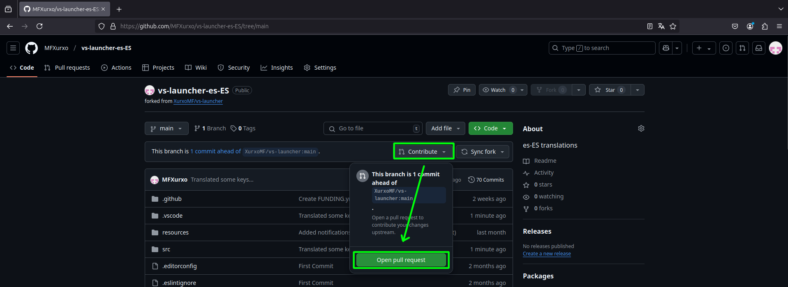<figcaption><p>Create a Pull Request</p></figcaption></figure>

Now change the title of the Pull Request and add a little description. Then just press `Create pull request`:

<figure>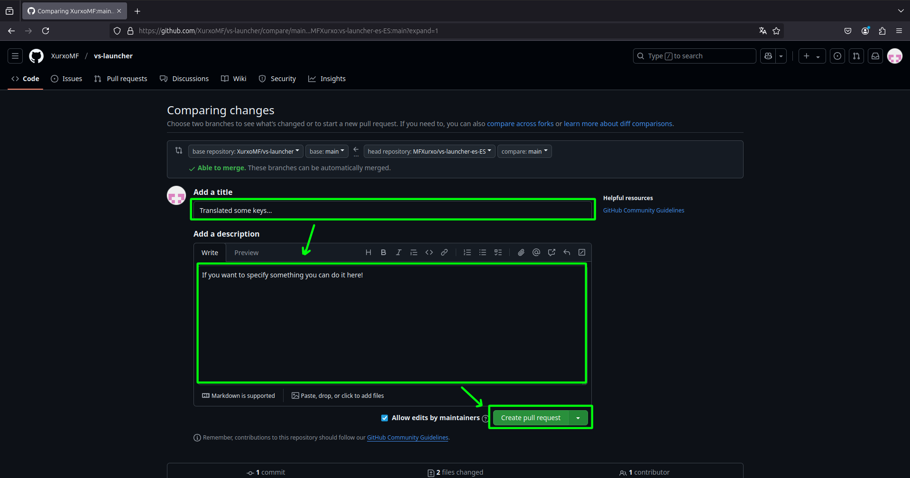<figcaption><p>Edit details for the Pull Request</p></figcaption></figure>



### **Sync the official repository with yours**

When changes are uploaded to the official repository you have to "copy" them to your repository. This can be done on GitHub. Go to your account, enter your repository and press `Sync fork` and then the green button:

<figure><figcaption><p>Sync repository</p></figcaption></figure>


There is no button on the image because I could not make changes to take the screenshot xD




### **Download the changes from GitHub to your pc**

Now, the new changes are synced with your repository on GitHub but not on your computes, you've to download them.

To do this just press the sync button on the bottom left corner of Visual Studio Code:

<div align="left"><figure>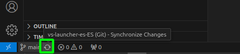<figcaption><p>Sync changes</p></figcaption></figure></div>



### **Translate, commit, push and make a Pull Request again**

Now you just have to repeat the same process to translate and send your changes.

This ones are steps **10**, **11** and **12** explained before.

When a new release is published check out if there are new keys to translate ^^



***

## How to add a new language



### **Create the lang file**

To add a new language you just need to add a new `.json` and link it with the app.

Go to the folder `src\renderer\src\locales` and create a new `xx-XX.json` with the language-location locales:

<figure>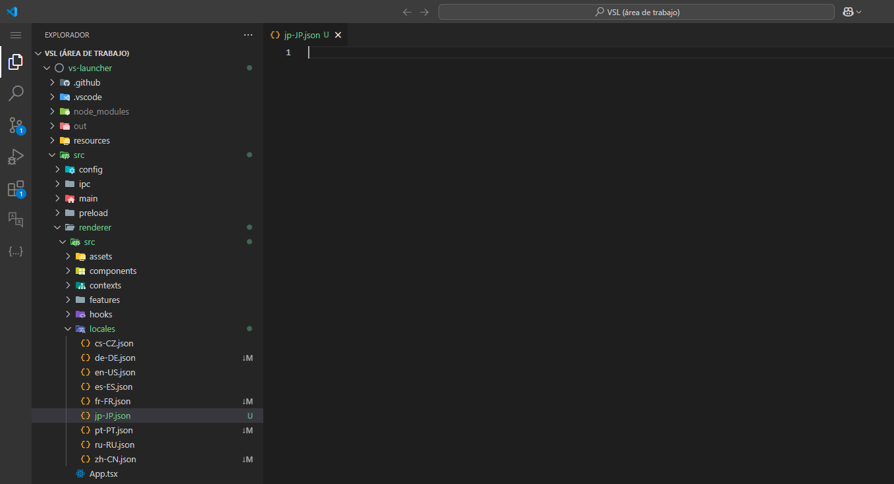<figcaption><p>Add a new language</p></figcaption></figure>



### **Add it to the languages menu**

On the `src\renderer\src\` folder there is a `i18n.ts` file.

If you open it you'll see how the other languages are set up, just add the import of your language at the bottom of the others and add a new item on the languages array like in the image:

<figure>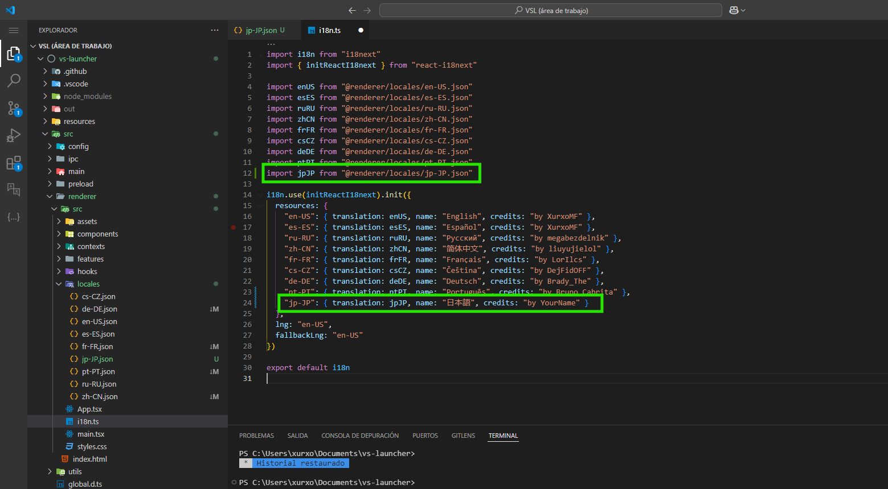<figcaption><p>Add language to the menu</p></figcaption></figure>



### **Translate**

Now just close those files, go to the translation menu on the left bar and you'll see the new language you've added!

Translate, commit, push and make a pull request... like if the language already existed.



